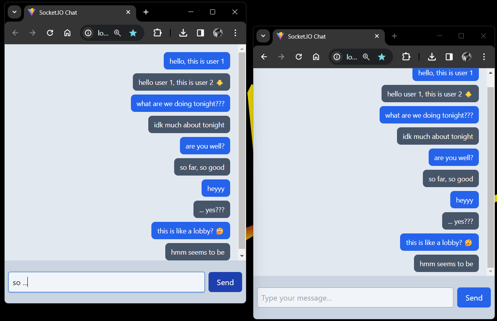

# Socket.IO Chatting App

Learning the Client-Server model in **JavaScript** using [Socket.IO](https://socket.io/) by building a chatting app that runs **locally**.

## Setup and Installation
1. Clone the repository : `git clone https://github.com:nirmit27/Chatting-App.git`
   
2. Open **two** terminals in your IDE, preferably **side by side** as shown in the next step.
   
3. Install the required dependencies: `npm install`  
4. Run the **Express** server : `npm run dev` in the `server` directory and the **React** client : `npm run dev` in the `client` directory as shown below :  
5. The **client** will be available at http://localhost:5173 and you can open **multiple** tabs to add clients as shown in the [preview](#preview).

## Preview

